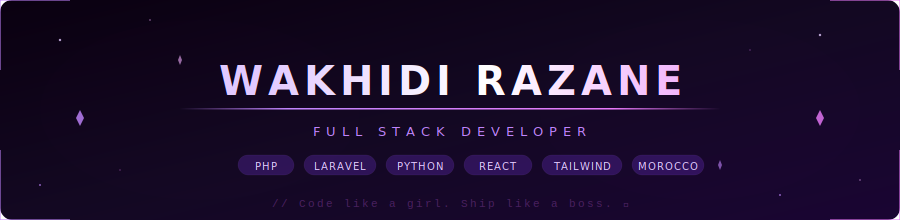

<div align="center">

<!-- BANNER -->


</div>

<br/>

<!-- Typing Animation - URL-encoded emojis for reliability -->


<br/>

<!-- Anime coding girl GIF -->


<br/><br/>


&nbsp;
[](https://github.com/razaane)

</div>

---

<div align="center">

## About Me

</div>

```javascript
const razane = {
  location:      "Morocco 🇲🇦",
  role:          "Full Stack Developer 💻",
  currentFocus:  ["Laravel", "React", "TailwindCSS"],
  expertise:     ["PHP", "JavaScript", "Python", "C/C++", "MySQL"],
  workingOn:     "Building scalable & beautiful web apps ✨",
  funFact:       "I debug with coffee ☕ — strong, sweet, served with a pink straw 🌸",
  philosophy:    "Code like a girl. Ship like a boss. 👑",
  lifeGoal:      "Contributing to open source & learning every single day 🚀",
};
```

---

<div align="center">

##  Tech Stack

**Frontend**


**Backend & Databases**


**Tools & Platforms**


</div>

---

<div align="center">

##  GitHub Stats


<br/>


</div>

---

<div align="center">

##  Activity Graph

[](https://github.com/razaane)

</div>

---

<div align="center">

## ☕ Fuel My Code

*"Behind every great line of code is an even greater iced coffee with oat milk 🧋💜"*

<br/>

[](https://buymeacoffee.com/razaane)

<br/>


</div>